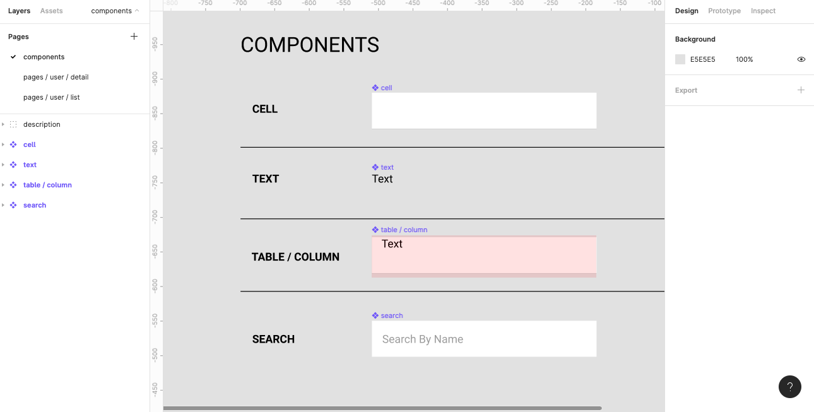
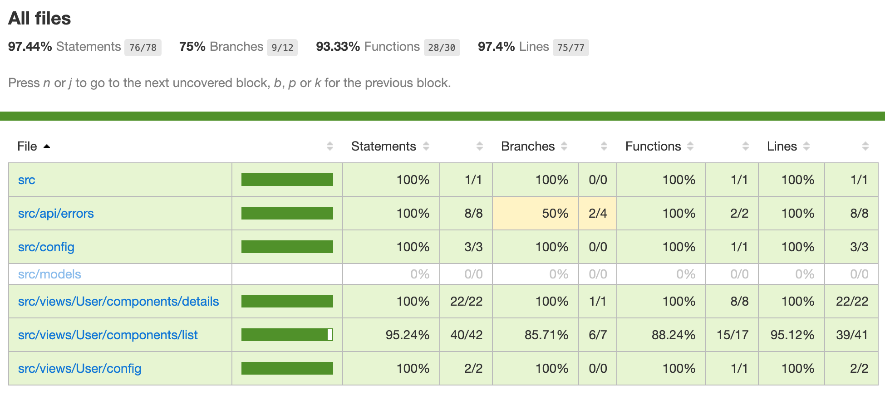
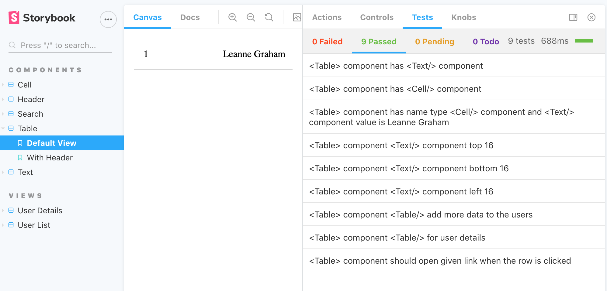
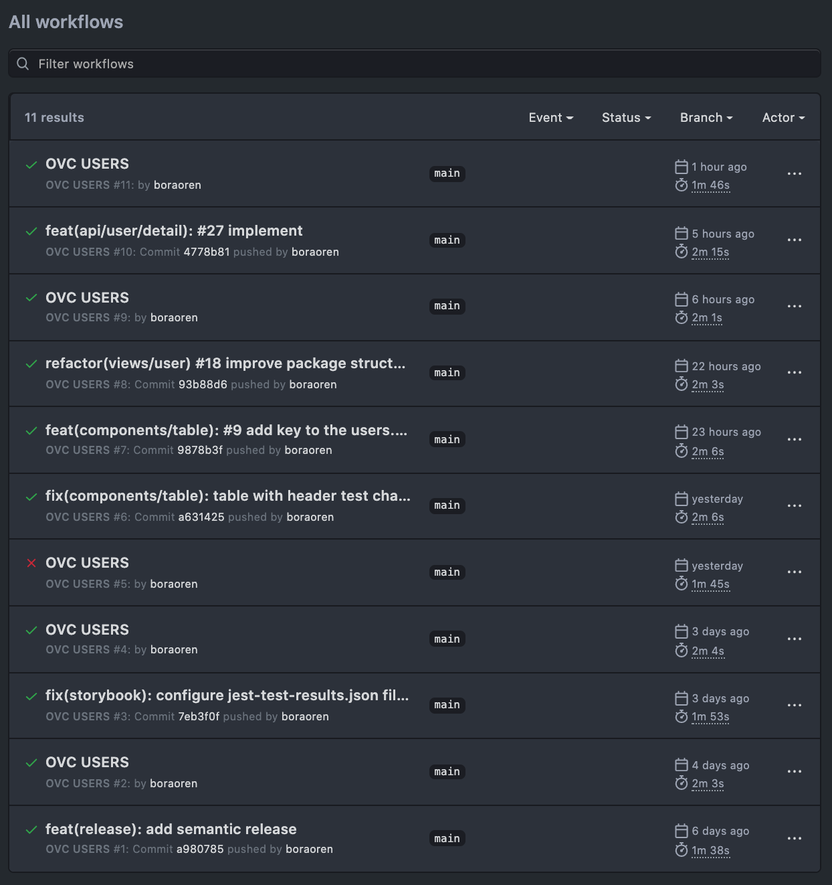
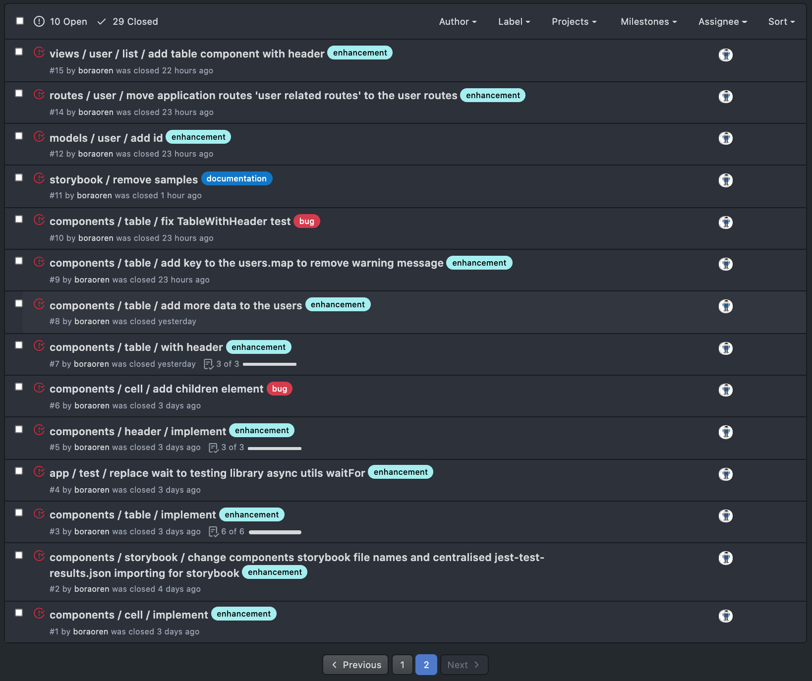

# Installation
1. `git clone https://github.com/boraoren/ovc-users.git`
1. `yarn install`
1. to run,
    1. __storybook__ `yarn storybook`
    1. __application__ in development mode `yarn start`

# Project OVC

for Figma low fidelity design check [here](https://www.figma.com/file/hN0f1ibYeeyllNQpxuHiBF/ovc-users?node-id=4%3A5)

## Users

|Name |	Email|	City|	Company|
|---|---|---|---|
|Leanne Graham|	Sincere@april.biz|	Gwenborough|	Romaguera-Crona|
|Ervin Howell|	Shanna@melissa.tv|	Wisokyburgh|	Deckow-Crist|
|zebra stripes|	Nathan@yesenia.net|	McKenziehaven|	Romaguera-Jacobson|

You can search users by using name keyword

## User Detail

|Title|	Body|
|---|---|
|sunt aut facere repellat provident occaecati excepturi optio reprehenderit |	quia et suscipit\nsuscipit recusandae consequuntur expedita et cum\nreprehenderit molestiae ut ut quas totam\nnostrum rerum est autem sunt rem eveniet architecto|

## Using APIs
`users` https://jsonplaceholder.typicode.com/users  
`user detail` https://jsonplaceholder.typicode.com/posts?userId=1

for more detail click [here](https://github.com/boraoren/ovc-users.git)

## Testing
### to run tests while development 
`yarn test --watch` 

### to show test coverage 
`yarn test:coverage`

### to generate test output for storybook jest addon 
`yarn test:generate-output`

 

## CI / CD
check [project github actions](https://github.com/boraoren/ovc-users/actions)

## ISSUES
check [github issues](https://github.com/boraoren/ovc-users/issues)

